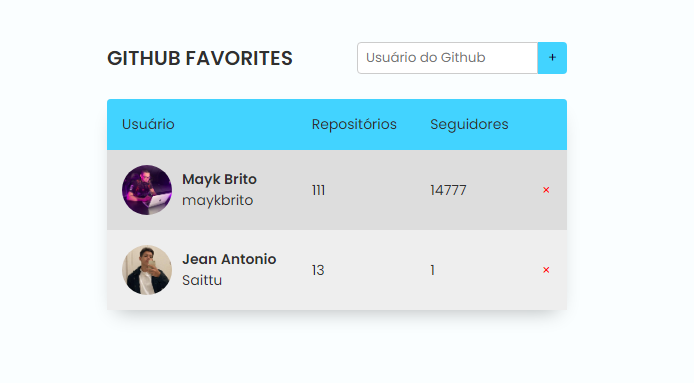

<h1 align="center">Github Favorites </h1>

Projeto disponibilizado pelo curso Explorer da Rocketseat, que proporciona uma visão
mais aprofundada em JS e APIs 

    <a href="#-tecnologias">Tecnologias</a>&nbsp;&nbsp;&nbsp;|&nbsp;&nbsp;&nbsp;
    <a href="#-Projeto">Projeto</a>&nbsp;&nbsp;&nbsp;|&nbsp;&nbsp;&nbsp;
    <a href="#-licença">Licença</a>

  

 

## Tecnologias

Usando as seguintes tecnologias

- JavaScript
- CSS
- HTML

## Projeto

Github Favorites é responsavel por buscar a usuário do github digitado e mostrar informações sobre a conta.

## Licença

MIT.